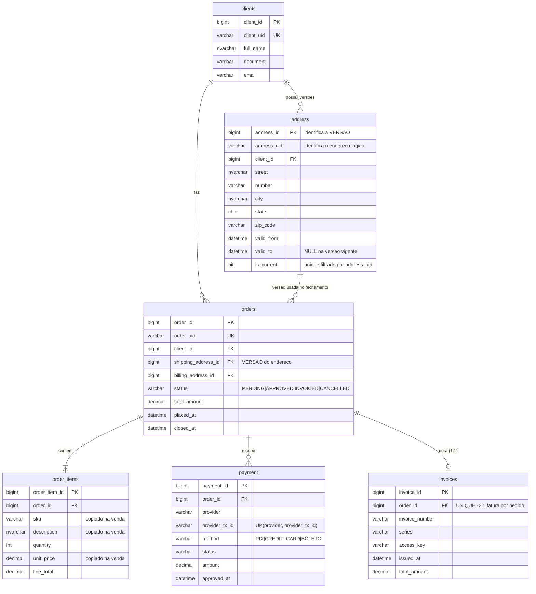
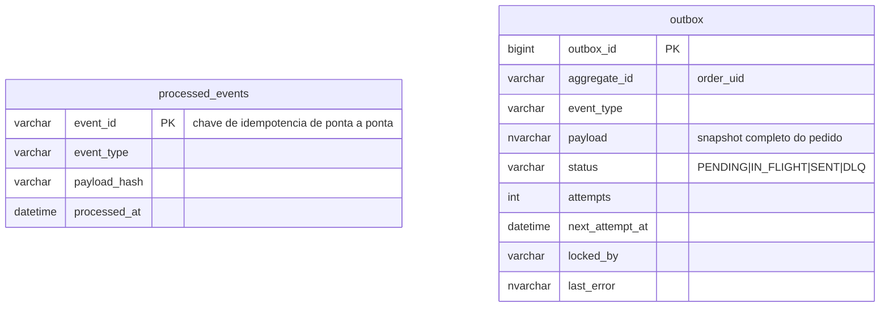

# Modelo de dados

## Tabelas de infraestrutura

## Analiticas (Parte 3)

| Tabela | Estrutura | Papel |
|---|---|---|
| `stg_order_history` | heap, **sem indice** | alvo do `BULK INSERT`; indice durante a carga custaria reordenacao 10M de vezes |
| `fact_order_history` | **clustered columnstore** | compressao ~10x; consulta analitica le so as colunas necessarias |

## As duas invariantes centrais

1. **Uma versao vigente por endereco logico**
   `CREATE UNIQUE INDEX ux_address_uid_current ON address (address_uid) WHERE is_current = 1`

2. **Uma fatura por pedido**
   `UNIQUE (order_id)` em `invoices` — e por isso que "evento duplicado nao gera
   faturamento duplicado" e uma garantia do banco, nao uma promessa da aplicacao.
